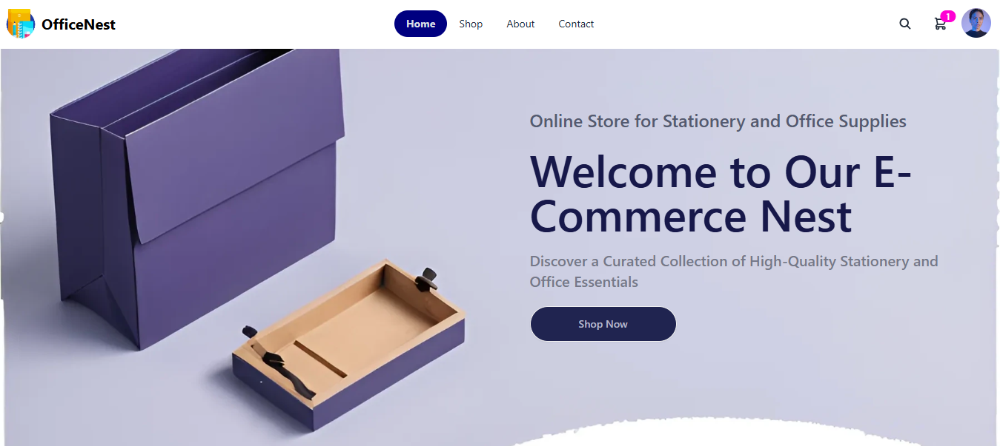

<h1 align="center"> OfficeNest </h1> <br>
<p align="center">
  <a href="https://react-phase2-fauzan.web.app/">
    
  </a>
</p>

<p align="center">
  Your One-Stop Shop for Office & Stationary Essentials. Built with React Javascript.
</p>

<!-- START doctoc generated TOC please keep comment here to allow auto update -->
<!-- DON'T EDIT THIS SECTION, INSTEAD RE-RUN doctoc TO UPDATE -->

## Table of Contents

- [Table of Contents](#table-of-contents)
- [Introduction](#introduction)
- [Features](#features)
  - [Admin Features:](#admin-features)
  - [Client Features:](#client-features)
- [Installation Proccess](#installation-proccess)
- [Tech Stack](#tech-stack)

<!-- END doctoc generated TOC please keep comment here to allow auto update -->

## Introduction

OfficeNest is your ultimate destination for premium stationery and office supplies, designed to enhance productivity and organization. Whether you’re managing a corporate office, setting up a home workspace, or simply looking for quality tools to support your day-to-day tasks, OfficeNest offers a curated selection of products to meet your needs.

With a commitment to quality, convenience, and exceptional customer service, OfficeNest ensures you have everything required to create a productive and inspiring workspace—all in one place. Join us in building efficient and organized work environments!

**Available for both client and admin side.**

<p align="center">
  
  <br >
  <a href="https://react-phase2-fauzan.web.app/client">Click here to explore the client-side interface.</a>
</p>

<br >
<p align="center">
  
  <br >
  <a href="https://react-phase2-fauzan.web.app/">Click here to explore the admin-side interface.</a>
</p>

## Features

A few of the things you can do with OfficeNest:

### Admin Features: 

- **View Products**: Access a complete list of products with detailed information.
- **Add Products**: Create new product listings with descriptions, prices, and categories.
- **Update Products**: Edit existing product details, including price, category, and stock.
- **Delete Products**: Remove products that are no longer available or relevant.

### Client Features:

- **View Products**: Browse a wide range of products with detailed descriptions.
- **Pagination for Products**: Navigate through product listings easily with paginated views.
- **Filter by Category and Price**: Narrow down product options by specific categories or price ranges.
- **Sort Products**: Organize products by price, name, or other attributes.
- **Search Products**: Quickly find specific products using the search bar.
- **Add to Cart**: Select products and add them to the shopping cart.
- **View Carts**: View all selected products in the cart with their details and totals.
- **Update Cart**: Adjust quantities of products in the cart.
- **Remove from Cart**: Delete products from the cart if no longer needed.
- **Checkout**: Complete the purchase of products securely from the cart.

**All features are fully responsive and optimized to provide a seamless user experience across desktop, tablet, and mobile devices.**

## Installation Proccess

1. **Clone the repository**:

   ```bash
   git clone https://github.com/fauzan3596/react-officenest.git
   cd react-officenest
   ```

2. **Install dependencies**:

   ```bash
   npm install
   ```

3. **SDK setup and configuration**:

   - Create a new Firebase project
   - Connect your Firebase project to your web app to get the Firebase SDK
   - Create a .env file in your root directory project
   - Copy your Firebase SDK to your .evn file with format just like in the .env.example file:
   - Add your .evn to .gitignore to avoid committing sensitive keys

   ```bash
   VITE_FIREBASE_APIKEY="your_api_key"
   VITE_FIREBASE_AUTHDOMAIN="your_authdomain"
   VITE_FIREBASE_PROJECTID="your_projectid"
   VITE_FIREBASE_STORAGEBUCKET="your_storagebucket"
   VITE_FIREBASE_MESSAGINGSENDERID="your_messagingsenderid"
   VITE_FIREBASE_APPID="your_appid"
   ```

4. **Add sign-in method**:

   - In your Firebase dashboard, navigate to Build > Authentication
   - In sign-in method tab, add new provider by enabling the email/password and google sign-in providers

5. **Create your own database**:

   - In your Firebase dashboard, navigate to Build > Firestore Database
   - Click create database then choose the location based on your nearest location
   - Choose the appropriate security rules (e.g., Test mode for development)

6. **Run the application**:
   ```bash
   npm run dev
   # View your application in your localhost http://localhost:YOUR_PORT_NUMBER
   ```

## Tech Stack

- **Front End**: React JS & Tailwind CSS
- **Back End**: Firebase (Firestore)
- **State Management**: Redux Toolkit
- **Fetching Data**: TanStack React Query
- **Image Hosting**: Cloudinary
- **Other Libraries**:
  - React Router Dom (for routing)
  - React Icons (for icons)
  - React Paginate (for pagination)
  - React Spinners (for loading spinner)
  - Sweetalert2 (for pop-up boxes)
